```python
ptp_img = np.ptp(data, axis=0) # This is the mean of the 'batch' channel
plt.imshow(ptp_img.astype(np.uint8))
```


    <matplotlib.image.AxesImage at 0x297025790>


    
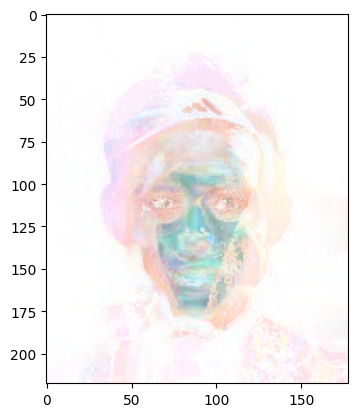
    


```python
median_img = np.median(data, axis=0) # This is the mean of the 'batch' channel
plt.imshow(median_img.astype(np.uint8))
```


    <matplotlib.image.AxesImage at 0x1779b2b20>


    
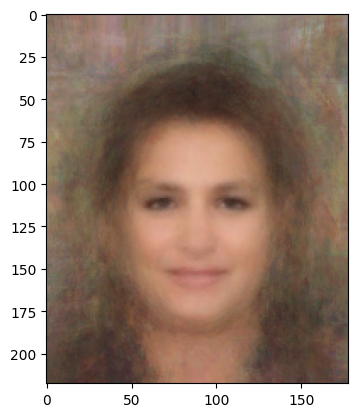
    


```python
plt.imshow(np.ptp(std_img, axis=2).astype(np.uint8)) # Mean of all colour channels
```


    <matplotlib.image.AxesImage at 0x1789c5dc0>


    
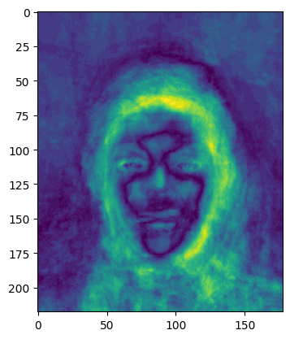
    


```python
from bs4 import BeautifulSoup
import urllib.request

# get the contents
response = urllib.request.urlopen('https://en.wikipedia.org/wiki/Python_(programming_language)')
html = response.read()

parsed_html = BeautifulSoup(html, 'html.parser')
toc_div = parsed_html.body.find('div', attrs={'class': 'toc'})
if toc_div is not None:
    print(toc_div.text)
else:
    print('Table of contents not found')

```

    Table of contents not found


```python
import requests
from bs4 import BeautifulSoup
import os

url = "https://www.vogue.com/"
response = requests.get(url)

soup = BeautifulSoup(response.content, 'html.parser')
images = soup.find_all('img')

# Create a directory to store the images
if not os.path.exists('images'):
    os.makedirs('images')

# Download and save the images
for img in images:
    img_url = img['src']
    filename = img['alt']
    try:
        img_data = requests.get(img_url).content
        with open(f'images/{filename}.jpg', 'wb') as handler:
            handler.write(img_data)
    except:
        print(f"Unable to download {filename}")
```

    Unable to download Vogue
    Unable to download Profile
    Unable to download Vogue
    Unable to download Profile
    Unable to download Vogue


```python
!pip install opencv-python
```

    Collecting opencv-python
      Downloading opencv_python-4.7.0.68-cp37-abi3-macosx_11_0_arm64.whl (31.1 MB)
         ━━━━━━━━━━━━━━━━━━━━━━━━━━━━━━━━━━━━━━━━ 31.1/31.1 MB 6.2 MB/s eta 0:00:0000:0100:01
    [?25hRequirement already satisfied: numpy>=1.21.0 in /Users/7jiang/miniforge3/envs/coding2/lib/python3.9/site-packages (from opencv-python) (1.23.2)
    Installing collected packages: opencv-python
    Successfully installed opencv-python-4.7.0.68


```python
import cv2
import os

# Define the new size for the images
new_size = (256, 256)

# Loop through each image in the dataset
for filename in os.listdir('images'):
    # Load the image using OpenCV
    image = cv2.imread(os.path.join('images', filename))
    
    # Resize the image while maintaining aspect ratio
    height, width, _ = image.shape
    if height > width:
        scale = new_size[1] / height
    else:
        scale = new_size[0] / width
    image = cv2.resize(image, None, fx=scale, fy=scale, interpolation=cv2.INTER_LINEAR)
    
    # Save the resized image back to the dataset
    cv2.imwrite(os.path.join('resized_dataset', filename), image)

```


```python
import PIL
import os
from PIL import Image
```


```python
import cv2
import os

# Define the path to the images directory
dir_path = 'images'

# Define the new size for the images
new_size = (500, 700)

# Loop through all files in the directory
for filename in os.listdir(dir_path):
    # Check if the file is an image
    if filename.endswith('.jpg') or filename.endswith('.png'):
        # Load the image
        image = cv2.imread(os.path.join(dir_path, filename))
        if image is None:
            print(f"Error reading {filename}")
            continue
        
        # Resize the image while maintaining aspect ratio
        height, width, _ = image.shape
        if height > width:
            scale = new_size[1] / height
        else:
            scale = new_size[0] / width
        resized_image = cv2.resize(image, (0,0), fx=scale, fy=scale)
        
        # Save the resized image with a new filename
        new_filename = os.path.splitext(filename)[0] + '_resized.jpg'
        cv2.imwrite(os.path.join(dir_path, new_filename), resized_image)

```


```python
import requests
from bs4 import BeautifulSoup
import os

url = "https://www.harpersbazaar.com/"
response = requests.get(url)

soup = BeautifulSoup(response.content, 'html.parser')
images = soup.find_all('img')

# Create a directory to store the images
if not os.path.exists('imagee'):
    os.makedirs('imagee')

# Download and save the images
for img in images:
    img_url = img['src']
    filename = img['alt']
    try:
        img_data = requests.get(img_url).content
        with open(f'imagee/{filename}.jpg', 'wb') as handler:
            handler.write(img_data)
    except:
        print(f"Unable to download {filename}")
```

    Unable to download Logo
    Unable to download premium exclusive pippa middleton and her husband james matthews enjoy a beach day with their kids arthur and grace during holidays in st barts 11 feb 2023 pictured pippa middleton and her husband james matthews photo credit mega themegaagencycom 1 888 505 6342 mega agency tagid mega941811009jpg photo via mega agency
    Unable to download london, england march 08 camilla, duchess of cornwall during a meeting with team extraoardinary at clarence house on march 08, 2022 in london, england team extraoardinary rowed their 23 foot boat “dolly parton” 3,000 miles from la gomera in the canaries to english harbour in antigua in 42 days, seven hours and 17 minutes to raise money for cancer charities macmillan, cancer research uk and the royal marsden cancer charity photo by chris jackson poolgetty images
    Unable to download dubai, united arab emirates january 21 ramona agruma and rebel wilson attend the grand reveal weekend for atlantis the royal, dubai's new ultra luxury hotel on january 21, 2023 in dubai, united arab emirates photo by jeff spicergetty images for atlantis the royal
    Unable to download british actor florence pugh poses on the red carpet upon arrival at the bafta british academy film awards at the royal festival hall, southbank centrer, in london, on february 19, 2023 photo by isabel infantes afp photo by isabel infantesafp via getty images
    Unable to download Logo
    Unable to download Hearst Fashion and Luxury Collection - A Part of Hearst Digital Media


```python
import cv2
import os

# Define the path to the images directory
dir_path = 'imagee'

# Define the new size for the images
new_size = (500, 700)

# Loop through all files in the directory
for filename in os.listdir(dir_path):
    # Check if the file is an image
    if filename.endswith('.jpg') or filename.endswith('.png'):
        # Load the image
        image = cv2.imread(os.path.join(dir_path, filename))
        if image is None:
            print(f"Error reading {filename}")
            continue
        
        # Resize the image while maintaining aspect ratio
        height, width, _ = image.shape
        if height > width:
            scale = new_size[1] / height
        else:
            scale = new_size[0] / width
        resized_image = cv2.resize(image, (0,0), fx=scale, fy=scale)
        
        # Save the resized image with a new filename
        new_filename = os.path.splitext(filename)[0] + '_resized.jpg'
        cv2.imwrite(os.path.join(dir_path, new_filename), resized_image)
```


```python
# Load the os library
import os

# Load the request module
import urllib.request

# Import SSL which we need to setup for talking to the HTTPS server
import ssl
ssl._create_default_https_context = ssl._create_unverified_context

# Create a directory
try: 
    os.mkdir('imagees')

    # Now perform the following 100 times:
    for img_i in range(1, 101):

        # create a string using the current loop counter
        f = '000%03d.jpg' % img_i

        # and get the url with that string appended the end
        url = '' + f

        # We'll print this out to the console so we can see how far we've gone
        print(url, end='\r')

        # And now download the url to a location inside our new directory
        urllib.request.urlretrieve(url, os.path.join('imagee', f))
except:
    #os.rm('img_align_celeba')
    print("You may need to delete the existing 'imagee' folder in your directory")
```

    https://s3.amazonaws.com/cadl/celeb-align/000100.jpg


```python
files = os.listdir('imagee')# img.<tab>
import matplotlib.pyplot as plt
import numpy as np

print(os.path.join('imagee', files[0]))
plt.imread(os.path.join('imagee', files[0]))

files = [os.path.join('imagee', file_i)
 for file_i in os.listdir('imagee')
 if '.jpg' in file_i]

img = plt.imread(files[99])

print(img)
```

    imagee/000036_resized.jpg
    [[[200 185 156]
      [200 185 156]
      [201 186 157]
      ...
      [191 168 137]
      [190 167 136]
      [190 167 136]]
    
     [[202 187 158]
      [202 187 158]
      [202 187 158]
      ...
      [191 168 137]
      [190 167 136]
      [190 167 136]]
    
     [[204 189 160]
      [203 188 159]
      [203 188 159]
      ...
      [191 168 137]
      [190 167 136]
      [190 167 136]]
    
     ...
    
     [[  7  15  18]
      [  7  15  18]
      [  7  15  18]
      ...
      [  4   4   6]
      [  3   3   3]
      [  3   3   3]]
    
     [[  5  13  16]
      [  5  13  16]
      [  5  13  16]
      ...
      [  3   3   5]
      [  3   3   3]
      [  3   3   3]]
    
     [[  5  13  16]
      [  5  13  16]
      [  5  13  16]
      ...
      [  3   3   5]
      [  3   3   3]
      [  3   3   3]]]


```python
# If nothing is drawn and you are using notebook, try uncommenting the next line:
#%matplotlib inline
plt.imshow(img)
```


    <matplotlib.image.AxesImage at 0x1258be070>


    
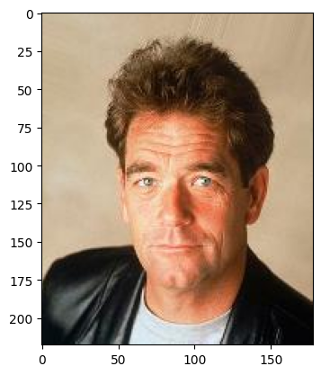
    


```python
img.shape
# (218, 178, 3)
```


    (218, 178, 3)


```python
plt.imshow(img[:, :, 0], cmap='gray') # Red Channel
```


    <matplotlib.image.AxesImage at 0x125ad93a0>


    
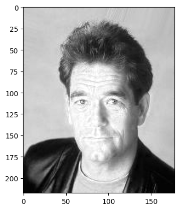
    


```python
plt.imshow(img[:, :, 1], cmap='gray') # Green Channel
```


    <matplotlib.image.AxesImage at 0x1269b6eb0>


    
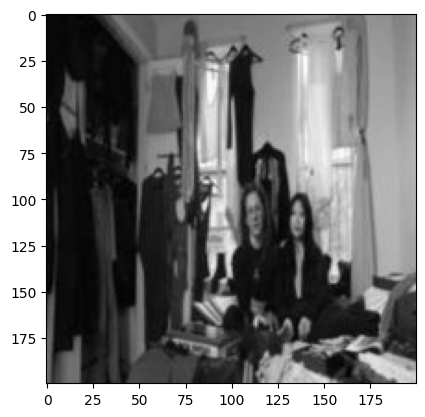
    


```python
import matplotlib.pyplot as plt

# Rest of the code
plt.imshow(img[:, :, 2], cmap='gray') # Green Channel
```


    <matplotlib.image.AxesImage at 0x125b4beb0>


    
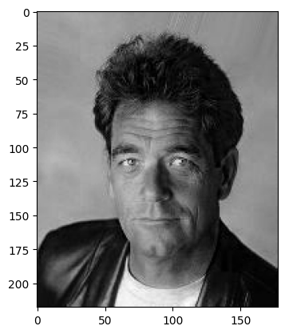
    


```python
imgs = [plt.imread(files[file_i])
        for file_i in range(47)]

#imgs = utils.get_celeb_imgs() # nope nope nope
```


```python
plt.imshow(imgs[29])
```


    <matplotlib.image.AxesImage at 0x126afeeb0>


    
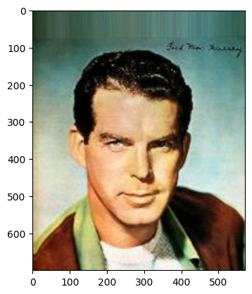
    


```python
imgs[0].shape
```


    (700, 572, 3)


```python
data = np.array(imgs) # make 'data' = our numpy array
data.shape
print(data.shape)
```

    (47,)


    /var/folders/b6/cg834gps6dz6n6vmyvl2r8n00000gn/T/ipykernel_19016/954142524.py:1: VisibleDeprecationWarning: Creating an ndarray from ragged nested sequences (which is a list-or-tuple of lists-or-tuples-or ndarrays with different lengths or shapes) is deprecated. If you meant to do this, you must specify 'dtype=object' when creating the ndarray.
      data = np.array(imgs) # make 'data' = our numpy array


```python
data = np.array(imgs) # make 'data' = our numpy array
data.shape
print(data.shape)
print("The shape of our new 'data' object is a 'batch' of 100 images, with a height of 218, width of 178, and 3 colour channels")
print("If your images aren't all the same size to begin with, then this won't work!")
```

    (47,)
    The shape of our new 'data' object is a 'batch' of 100 images, with a height of 218, width of 178, and 3 colour channels
    If your images aren't all the same size to begin with, then this won't work!


    /var/folders/b6/cg834gps6dz6n6vmyvl2r8n00000gn/T/ipykernel_19016/322644463.py:1: VisibleDeprecationWarning: Creating an ndarray from ragged nested sequences (which is a list-or-tuple of lists-or-tuples-or ndarrays with different lengths or shapes) is deprecated. If you meant to do this, you must specify 'dtype=object' when creating the ndarray.
      data = np.array(imgs) # make 'data' = our numpy array


```python
import cv2
import numpy as np
import os

# Load all the images
imgs = []
for f in os.listdir('images'):
    if f.endswith('.jpg'):
        img = cv2.imread(os.path.join('images', f))
        img = cv2.resize(img, (200, 200))
        imgs.append(img)

# Convert the list of images to a numpy array
data = np.array(imgs, dtype=np.uint8)

```


```python
std_img = np.std(data, axis=0)
plt.imshow(std_img.astype(np.uint8))
print("This is the standard deviation - the variance of the mean")
```

    This is the standard deviation - the variance of the mean


    
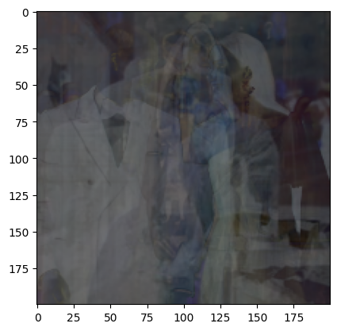
    


```python
plt.imshow(np.ptp(std_img, axis=2).astype(np.uint8)) # Mean of all colour channels
```


    <matplotlib.image.AxesImage at 0x127a995e0>


    
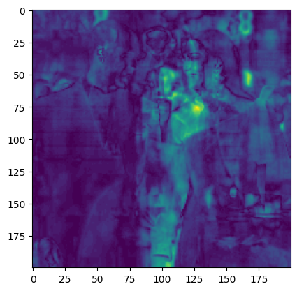
    


```python
ptp_img = np.ptp(data, axis=0) # This is the mean of the 'batch' channel
plt.imshow(ptp_img.astype(np.uint8))
```


    <matplotlib.image.AxesImage at 0x126b7ea30>


    
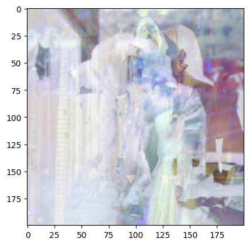
    


```python
mean_img = np.mean(data, axis=0) # This is the mean of the 'batch' channel
plt.imshow(mean_img.astype(np.uint8))
```


    <matplotlib.image.AxesImage at 0x1258ca610>


    
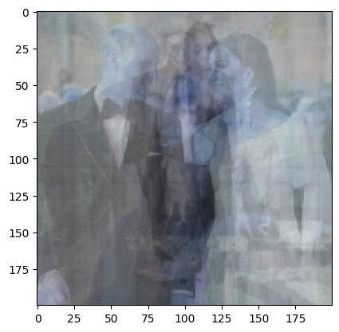
    


```python
flattened = data.ravel()
# https://docs.scipy.org/doc/numpy/reference/generated/numpy.ravel.html
print(data[:1])
print(flattened[:10])

```

    [[[[151 194 221]
       [153 196 223]
       [145 186 211]
       ...
       [249 255 250]
       [248 254 249]
       [247 253 248]]
    
      [[157 200 227]
       [157 200 227]
       [146 186 214]
       ...
       [248 255 250]
       [247 254 251]
       [246 253 248]]
    
      [[160 202 231]
       [156 199 226]
       [142 185 212]
       ...
       [245 254 251]
       [245 253 252]
       [244 253 250]]
    
      ...
    
      [[185 191 202]
       [189 195 206]
       [193 202 212]
       ...
       [127 159 154]
       [149 181 176]
       [102 134 129]]
    
      [[192 198 209]
       [193 199 210]
       [194 203 213]
       ...
       [126 158 153]
       [157 189 184]
       [106 138 133]]
    
      [[189 195 206]
       [190 196 207]
       [192 201 211]
       ...
       [132 164 159]
       [171 203 198]
       [119 151 146]]]]
    [151 194 221 153 196 223 145 186 211 126]


```python
plt.hist(flattened.ravel(), 255)
```


    (array([56021., 25815., 29614., 27819., 20874., 16581., 13894., 12860.,
            13314., 13247., 12884., 11862., 11577., 11570., 10617.,  9613.,
             8637.,  8043.,  7950.,  7498.,  7463.,  7166.,  7300.,  7587.,
             7736.,  7990.,  8418.,  8801.,  8245.,  7707.,  6917.,  5761.,
             5020.,  4485.,  3752.,  3892.,  3657.,  3401.,  3451.,  3451.,
             3433.,  3617.,  3365.,  3157.,  3292.,  3196.,  3215.,  3111.,
             3076.,  2992.,  2987.,  2974.,  2874.,  2840.,  2988.,  2827.,
             2877.,  2769.,  2748.,  2736.,  2675.,  2650.,  2644.,  2632.,
             2704.,  2752.,  2742.,  2643.,  2747.,  2661.,  2644.,  2630.,
             2674.,  2602.,  2727.,  2835.,  2884.,  2892.,  2989.,  2937.,
             3023.,  2954.,  3112.,  3240.,  3218.,  3322.,  3185.,  3349.,
             3625.,  3812.,  3796.,  4030.,  3856.,  3768.,  3845.,  3720.,
             3671.,  3789.,  3539.,  3458.,  3595.,  3499.,  3571.,  3580.,
             3642.,  3744.,  3783.,  3961.,  3960.,  4006.,  4196.,  4464.,
             4438.,  4534.,  4718.,  4867.,  5061.,  4913.,  4995.,  5057.,
             5186.,  4946.,  4593.,  4744.,  4622.,  4668.,  4655.,  4554.,
             4592.,  4782.,  4660.,  4685.,  4926.,  5168.,  5438.,  5746.,
             5871.,  6236.,  6484.,  6526.,  6339.,  6121.,  5708.,  5939.,
             6125.,  6152.,  5972.,  5966.,  6141.,  6486.,  7041.,  7293.,
             6879.,  6259.,  5863.,  6229.,  6457.,  6195.,  5925.,  6029.,
             6290.,  6621.,  6819.,  6987.,  7251.,  7774.,  8050.,  8412.,
             9094.,  9052.,  9643.,  9997., 10471., 10631., 10574.,  9806.,
             9368.,  9469.,  9520.,  9146.,  9202.,  9132.,  9798.,  9716.,
             9907.,  9838., 10172., 10286., 10629., 10327., 10689., 10894.,
            11321., 11291., 11087., 11348., 11685., 11942., 12219., 12390.,
            12804., 13445., 13968., 14197., 14870., 15259., 14829., 15110.,
            15470., 15562., 15549., 15348., 15415., 15312., 15999., 16466.,
            16132., 16612., 16716., 17308., 17094., 17088., 16579., 15206.,
            14246., 13999., 13288., 12651., 11120., 10349.,  9296.,  8352.,
             7818.,  7509.,  7052.,  6715.,  6423.,  6374.,  6030.,  5632.,
             5334.,  4970.,  4590.,  4169.,  3853.,  3662.,  3384.,  3142.,
             3193.,  2963.,  2903.,  3345.,  3339.,  3380.,  8408.]),
     array([  0.,   1.,   2.,   3.,   4.,   5.,   6.,   7.,   8.,   9.,  10.,
             11.,  12.,  13.,  14.,  15.,  16.,  17.,  18.,  19.,  20.,  21.,
             22.,  23.,  24.,  25.,  26.,  27.,  28.,  29.,  30.,  31.,  32.,
             33.,  34.,  35.,  36.,  37.,  38.,  39.,  40.,  41.,  42.,  43.,
             44.,  45.,  46.,  47.,  48.,  49.,  50.,  51.,  52.,  53.,  54.,
             55.,  56.,  57.,  58.,  59.,  60.,  61.,  62.,  63.,  64.,  65.,
             66.,  67.,  68.,  69.,  70.,  71.,  72.,  73.,  74.,  75.,  76.,
             77.,  78.,  79.,  80.,  81.,  82.,  83.,  84.,  85.,  86.,  87.,
             88.,  89.,  90.,  91.,  92.,  93.,  94.,  95.,  96.,  97.,  98.,
             99., 100., 101., 102., 103., 104., 105., 106., 107., 108., 109.,
            110., 111., 112., 113., 114., 115., 116., 117., 118., 119., 120.,
            121., 122., 123., 124., 125., 126., 127., 128., 129., 130., 131.,
            132., 133., 134., 135., 136., 137., 138., 139., 140., 141., 142.,
            143., 144., 145., 146., 147., 148., 149., 150., 151., 152., 153.,
            154., 155., 156., 157., 158., 159., 160., 161., 162., 163., 164.,
            165., 166., 167., 168., 169., 170., 171., 172., 173., 174., 175.,
            176., 177., 178., 179., 180., 181., 182., 183., 184., 185., 186.,
            187., 188., 189., 190., 191., 192., 193., 194., 195., 196., 197.,
            198., 199., 200., 201., 202., 203., 204., 205., 206., 207., 208.,
            209., 210., 211., 212., 213., 214., 215., 216., 217., 218., 219.,
            220., 221., 222., 223., 224., 225., 226., 227., 228., 229., 230.,
            231., 232., 233., 234., 235., 236., 237., 238., 239., 240., 241.,
            242., 243., 244., 245., 246., 247., 248., 249., 250., 251., 252.,
            253., 254., 255.]),
     <BarContainer object of 255 artists>)


    
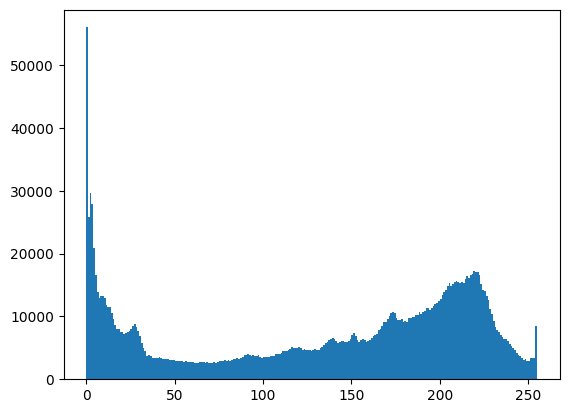
    


```python
plt.hist(mean_img.ravel(), 255)
```


    (array([1.000e+00, 0.000e+00, 6.000e+00, 3.000e+00, 7.000e+00, 7.000e+00,
            1.300e+01, 1.800e+01, 1.500e+01, 1.800e+01, 1.100e+01, 1.500e+01,
            1.400e+01, 1.300e+01, 2.400e+01, 3.200e+01, 2.800e+01, 3.200e+01,
            4.400e+01, 4.900e+01, 3.800e+01, 5.000e+01, 4.700e+01, 4.700e+01,
            7.100e+01, 7.900e+01, 7.600e+01, 8.400e+01, 6.800e+01, 7.500e+01,
            8.500e+01, 8.100e+01, 1.040e+02, 1.090e+02, 1.070e+02, 1.090e+02,
            1.300e+02, 9.600e+01, 1.330e+02, 1.380e+02, 1.190e+02, 1.490e+02,
            1.370e+02, 1.520e+02, 1.650e+02, 1.770e+02, 1.610e+02, 2.160e+02,
            2.180e+02, 1.830e+02, 2.070e+02, 2.220e+02, 2.360e+02, 1.980e+02,
            2.050e+02, 2.230e+02, 2.340e+02, 2.120e+02, 2.390e+02, 2.110e+02,
            2.060e+02, 2.410e+02, 2.340e+02, 2.030e+02, 2.390e+02, 2.530e+02,
            2.210e+02, 2.620e+02, 2.470e+02, 2.450e+02, 2.980e+02, 3.020e+02,
            2.940e+02, 3.320e+02, 3.060e+02, 2.860e+02, 2.990e+02, 3.090e+02,
            3.300e+02, 3.710e+02, 4.100e+02, 3.900e+02, 4.220e+02, 4.290e+02,
            4.510e+02, 4.700e+02, 4.790e+02, 5.990e+02, 6.310e+02, 6.100e+02,
            7.320e+02, 7.790e+02, 7.500e+02, 8.610e+02, 8.890e+02, 8.650e+02,
            9.430e+02, 1.050e+03, 9.520e+02, 1.126e+03, 1.112e+03, 1.110e+03,
            1.241e+03, 1.274e+03, 1.194e+03, 1.227e+03, 1.198e+03, 1.113e+03,
            1.070e+03, 1.048e+03, 9.320e+02, 9.630e+02, 9.360e+02, 7.720e+02,
            8.390e+02, 7.270e+02, 7.680e+02, 7.360e+02, 6.190e+02, 6.000e+02,
            5.740e+02, 5.170e+02, 5.290e+02, 5.160e+02, 5.110e+02, 5.190e+02,
            5.100e+02, 4.740e+02, 5.370e+02, 4.670e+02, 4.470e+02, 4.990e+02,
            4.920e+02, 4.020e+02, 4.350e+02, 4.380e+02, 4.110e+02, 4.420e+02,
            4.270e+02, 4.050e+02, 4.500e+02, 4.080e+02, 5.200e+02, 4.670e+02,
            4.650e+02, 4.640e+02, 5.150e+02, 4.400e+02, 5.640e+02, 5.970e+02,
            4.900e+02, 5.600e+02, 5.490e+02, 5.540e+02, 5.860e+02, 6.300e+02,
            6.360e+02, 7.590e+02, 6.760e+02, 7.130e+02, 7.990e+02, 8.410e+02,
            8.050e+02, 8.410e+02, 8.520e+02, 7.890e+02, 8.650e+02, 9.080e+02,
            8.690e+02, 1.008e+03, 9.330e+02, 1.115e+03, 1.158e+03, 1.065e+03,
            1.123e+03, 1.182e+03, 1.143e+03, 1.152e+03, 1.213e+03, 1.122e+03,
            1.216e+03, 1.241e+03, 1.188e+03, 1.262e+03, 1.239e+03, 1.169e+03,
            1.301e+03, 1.286e+03, 1.050e+03, 1.119e+03, 1.113e+03, 1.052e+03,
            1.047e+03, 1.035e+03, 9.510e+02, 9.550e+02, 9.320e+02, 7.990e+02,
            8.240e+02, 7.500e+02, 7.600e+02, 7.260e+02, 6.250e+02, 6.760e+02,
            6.060e+02, 5.310e+02, 5.320e+02, 5.140e+02, 4.570e+02, 4.980e+02,
            4.950e+02, 4.350e+02, 4.910e+02, 4.220e+02, 3.950e+02, 3.920e+02,
            3.870e+02, 3.170e+02, 3.410e+02, 3.140e+02, 2.630e+02, 2.790e+02,
            2.990e+02, 2.420e+02, 2.400e+02, 2.420e+02, 2.100e+02, 2.140e+02,
            1.840e+02, 1.750e+02, 1.640e+02, 1.450e+02, 1.190e+02, 1.170e+02,
            1.000e+02, 7.900e+01, 6.400e+01, 5.500e+01, 5.300e+01, 3.700e+01,
            2.800e+01, 2.400e+01, 1.800e+01, 1.400e+01, 1.100e+01, 8.000e+00,
            1.400e+01, 8.000e+00, 8.000e+00, 5.000e+00, 8.000e+00, 7.000e+00,
            4.000e+00, 2.000e+00, 3.000e+00]),
     array([ 29.8125    ,  30.54093137,  31.26936275,  31.99779412,
             32.72622549,  33.45465686,  34.18308824,  34.91151961,
             35.63995098,  36.36838235,  37.09681373,  37.8252451 ,
             38.55367647,  39.28210784,  40.01053922,  40.73897059,
             41.46740196,  42.19583333,  42.92426471,  43.65269608,
             44.38112745,  45.10955882,  45.8379902 ,  46.56642157,
             47.29485294,  48.02328431,  48.75171569,  49.48014706,
             50.20857843,  50.9370098 ,  51.66544118,  52.39387255,
             53.12230392,  53.85073529,  54.57916667,  55.30759804,
             56.03602941,  56.76446078,  57.49289216,  58.22132353,
             58.9497549 ,  59.67818627,  60.40661765,  61.13504902,
             61.86348039,  62.59191176,  63.32034314,  64.04877451,
             64.77720588,  65.50563725,  66.23406863,  66.9625    ,
             67.69093137,  68.41936275,  69.14779412,  69.87622549,
             70.60465686,  71.33308824,  72.06151961,  72.78995098,
             73.51838235,  74.24681373,  74.9752451 ,  75.70367647,
             76.43210784,  77.16053922,  77.88897059,  78.61740196,
             79.34583333,  80.07426471,  80.80269608,  81.53112745,
             82.25955882,  82.9879902 ,  83.71642157,  84.44485294,
             85.17328431,  85.90171569,  86.63014706,  87.35857843,
             88.0870098 ,  88.81544118,  89.54387255,  90.27230392,
             91.00073529,  91.72916667,  92.45759804,  93.18602941,
             93.91446078,  94.64289216,  95.37132353,  96.0997549 ,
             96.82818627,  97.55661765,  98.28504902,  99.01348039,
             99.74191176, 100.47034314, 101.19877451, 101.92720588,
            102.65563725, 103.38406863, 104.1125    , 104.84093137,
            105.56936275, 106.29779412, 107.02622549, 107.75465686,
            108.48308824, 109.21151961, 109.93995098, 110.66838235,
            111.39681373, 112.1252451 , 112.85367647, 113.58210784,
            114.31053922, 115.03897059, 115.76740196, 116.49583333,
            117.22426471, 117.95269608, 118.68112745, 119.40955882,
            120.1379902 , 120.86642157, 121.59485294, 122.32328431,
            123.05171569, 123.78014706, 124.50857843, 125.2370098 ,
            125.96544118, 126.69387255, 127.42230392, 128.15073529,
            128.87916667, 129.60759804, 130.33602941, 131.06446078,
            131.79289216, 132.52132353, 133.2497549 , 133.97818627,
            134.70661765, 135.43504902, 136.16348039, 136.89191176,
            137.62034314, 138.34877451, 139.07720588, 139.80563725,
            140.53406863, 141.2625    , 141.99093137, 142.71936275,
            143.44779412, 144.17622549, 144.90465686, 145.63308824,
            146.36151961, 147.08995098, 147.81838235, 148.54681373,
            149.2752451 , 150.00367647, 150.73210784, 151.46053922,
            152.18897059, 152.91740196, 153.64583333, 154.37426471,
            155.10269608, 155.83112745, 156.55955882, 157.2879902 ,
            158.01642157, 158.74485294, 159.47328431, 160.20171569,
            160.93014706, 161.65857843, 162.3870098 , 163.11544118,
            163.84387255, 164.57230392, 165.30073529, 166.02916667,
            166.75759804, 167.48602941, 168.21446078, 168.94289216,
            169.67132353, 170.3997549 , 171.12818627, 171.85661765,
            172.58504902, 173.31348039, 174.04191176, 174.77034314,
            175.49877451, 176.22720588, 176.95563725, 177.68406863,
            178.4125    , 179.14093137, 179.86936275, 180.59779412,
            181.32622549, 182.05465686, 182.78308824, 183.51151961,
            184.23995098, 184.96838235, 185.69681373, 186.4252451 ,
            187.15367647, 187.88210784, 188.61053922, 189.33897059,
            190.06740196, 190.79583333, 191.52426471, 192.25269608,
            192.98112745, 193.70955882, 194.4379902 , 195.16642157,
            195.89485294, 196.62328431, 197.35171569, 198.08014706,
            198.80857843, 199.5370098 , 200.26544118, 200.99387255,
            201.72230392, 202.45073529, 203.17916667, 203.90759804,
            204.63602941, 205.36446078, 206.09289216, 206.82132353,
            207.5497549 , 208.27818627, 209.00661765, 209.73504902,
            210.46348039, 211.19191176, 211.92034314, 212.64877451,
            213.37720588, 214.10563725, 214.83406863, 215.5625    ]),
     <BarContainer object of 255 artists>)


    
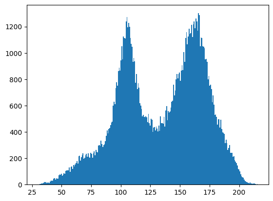
    


```python
bins = 20
fig, axs = plt.subplots(1, 3, figsize=(12, 6), sharey=True, sharex=True)
axs[0].hist((data[0]).ravel(), bins)
axs[0].set_title('img distribution')
axs[1].hist((mean_img).ravel(), bins)
axs[1].set_title('mean distribution')
axs[2].hist((data[0] - mean_img).ravel(), bins)
axs[2].set_title('(img - mean) distribution')
```


    Text(0.5, 1.0, '(img - mean) distribution')


    
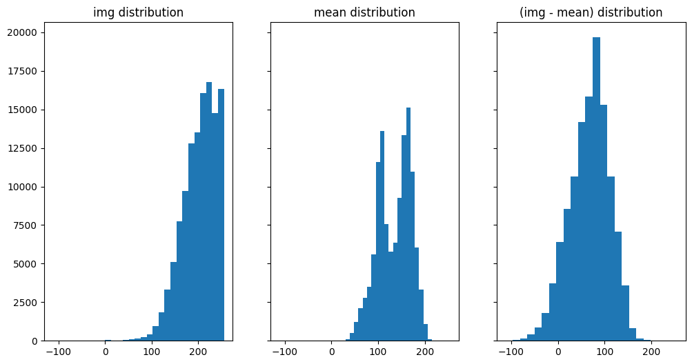
    


```python
fig, axs = plt.subplots(1, 3, figsize=(12, 6), sharey=True, sharex=True)
axs[0].hist((data[0] - mean_img).ravel(), bins)
axs[0].set_title('(img - mean) distribution')
axs[1].hist((std_img).ravel(), bins)
axs[1].set_title('std deviation distribution')
axs[2].hist(((data[0] - mean_img) / std_img).ravel(), bins)
axs[2].set_title('((img - mean) / std_dev) distribution')

```


    Text(0.5, 1.0, '((img - mean) / std_dev) distribution')


    
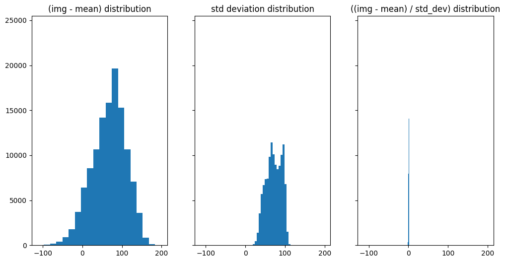
    


```python

```
